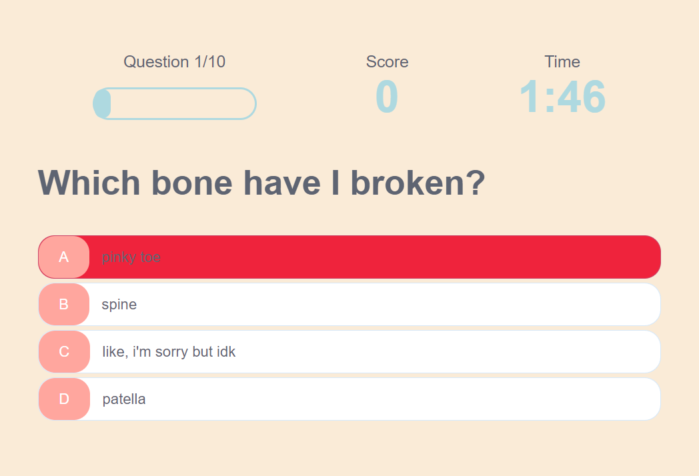
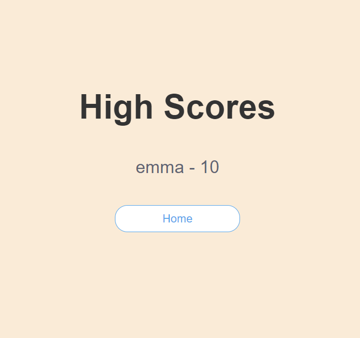

# A quiz all about me!

## Description 
A quiz all about fun facts about me! Created with JavaScript, html, css. The quiz is 10 questions and players have ___ minutes to complete it. However, be warned! If the player gets the answer wrong, 5 seconds will be deducted from their time.

## Installation
N/A
## Usage 
You can access the quiz here: https://emcarr99.github.io/letsgetquizzical/

Upon clicking the above link, you will be taken to the Home page where you have the choice to 'Play' or checkout the 'High Scores' page. Can't make it on the high score page unless you play tho! 

When you click 'Play' the quiz begins! You will see the progress bar, score tracker, and the timer!

The progress bar will fill up as you continue through the quiz when you get an answer wrong(oh no!) the answer choice will flash red and 5 seconds will be deducted from your timer. If you get the answer right (oh yeah!) then the answer will flash green and you will be given 1 point.

If you're stuck on a question and run out of time(so sad) then you will automatically be directed to the end of the quiz. If you complete the quiz in time, then you will end up at the same end page. Where you will enter your initials or name and click 'save' to save your score! If you (or friends) play more than 5 times (on the same browser) then you can check out the top 5 high scores on the 'High Score' page! (pst! Clicking on the 'Cheat Sheet' right now will bring you to a 'coming soon' page but soon will have the quiz answers)

From the 'High Score' page you can return to the 'Home' page just by clicking the 'Home' button.

Have fun playing!
## Credits 
The following tutorials by James Q. Quick (https://www.youtube.com/@JamesQQuick) were referenced throughout this project to guide and deepen my understanding of JavaScript methods used to complete these projects.

https://youtu.be/_LYxkClHnV0
https://youtu.be/BOQLbu_Crc0
https://youtu.be/jK5zzSA2JHI

## license
MIT license
